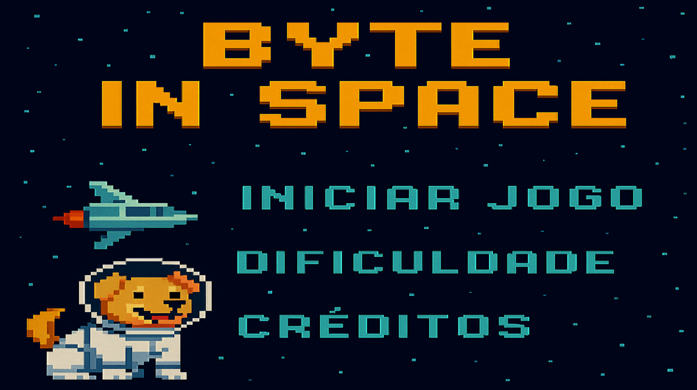

# Byte in Space 🐶🚀💫

## Equipe 🧑‍💻
<table>
  <tr>
    <td align="center">
      <a href="https://github.com/gustavocharamba">
        <br />
        <sub><b>Gustavo Charamba</b></sub>
      </a>
    </td>
    <td align="center">
      <a href="https://github.com/lgss0">
        <br />
        <sub><b>lgss0</b></sub>
      </a>
    </td>
    <td align="center">
      <a href="https://github.com/SmouraCodeX">
        <br />
        <sub><b>SmouraCodeX</b></sub>
      </a>
    </td>
    <td align="center">
      <a href="https://github.com/lebb8">
        <br />
        <sub><b>lebb8</b></sub>
      </a>
    </td>
    <td align="center">
      <a href="https://github.com/luizmiguelbarbosa">
        <br />
        <sub><b>Luiz Miguel Barbosa</b></sub>
      </a>
    </td>
    <td align="center">
      <a href="https://github.com/miqueias-santos">
        <br />
        <sub><b>Miqueuias Santos</b></sub>
  </tr>
</table>

## Instalando o jogo ⚙️🛠️

Clone o repositório
```bash
git clone https://github.com/luizmiguelbarbosa/byte_in_space.git
```
No PowerShell, execute:
```bash
Set-ExecutionPolicy RemoteSigned -Scope Process
& byte_in_space/venv/Scripts/Activate.ps1
```
```bash
cd byte_in_space
```
```bash
pip install -r requirements.txt
```
## Estruturas de Pastas 📂
Arquitetura de Pastas do Projeto
### entites
Classes das entidades do jogo. Ex: `Player`, `Inimigos` e `Coletáveis`
```bash
├── entities
│   ├── coletavel.py
│   ├── eventos.py
│   ├── inimigo.py
│   ├── nave.py
│   ├── render.py
│   └── update.py
```
### assets
Arquivos de assets do jogo. Ex: `Imagens`, `Músicas` e `Vídeos`
```bash
├── assets
│   ├── imagens
│   │   ├── cenario1.png
│   │   ├── circuito.png
│   │   ├── computador.png
│   │   ├── dados.png
│   │   ├── icone_janela.png
│   │   ├── imagem_menu.png
│   │   ├── sprite_inimigo.png
│   │   └── sprite_nave.png
│   ├── musicas
│   │   ├── musica_jogo.mp3
│   │   ├── musica_start.mp3
│   │   └── tiro.mp3
│   └── videos
│       └── cutscene1.mp4
```
## Capturas de Tela 🎮


