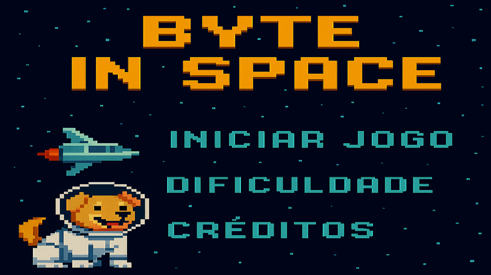
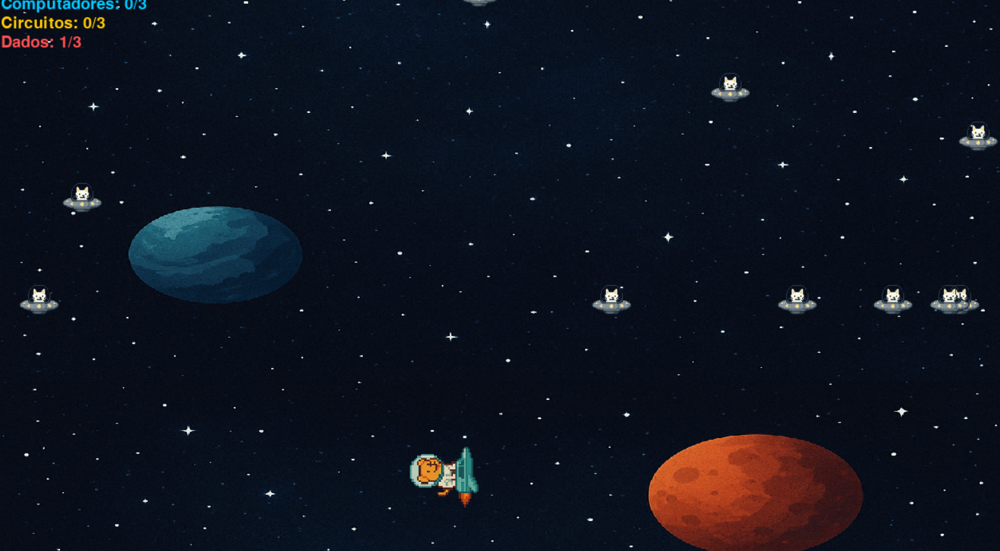
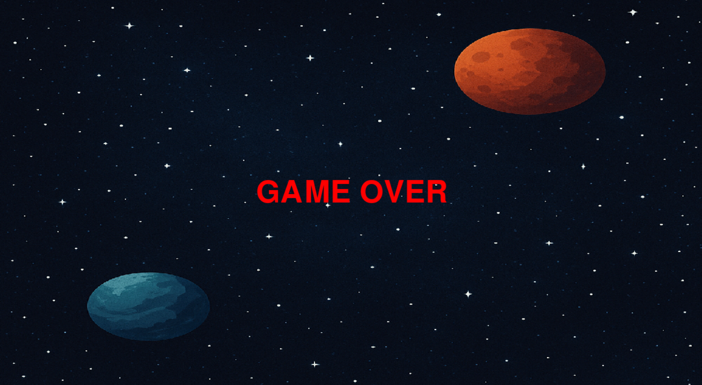

# Byte in Space 🐶🚀💫

## Equipe 🧑‍💻
<table>
  <tr>
    <td align="center">
      <a href="https://github.com/gustavocharamba">
        <br />
        <sub><b>Gustavo Charamba</b></sub>
      </a>
    </td>
    <td align="center">
      <a href="https://github.com/lgss0">
        <br />
        <sub><b>lgss0</b></sub>
      </a>
    </td>
    <td align="center">
      <a href="https://github.com/SmouraCodeX">
        <br />
        <sub><b>SmouraCodeX</b></sub>
      </a>
    </td>
    <td align="center">
      <a href="https://github.com/lebb8">
        <br />
        <sub><b>lebb8</b></sub>
      </a>
    </td>
    <td align="center">
      <a href="https://github.com/luizmiguelbarbosa">
        <br />
        <sub><b>Luiz Miguel Barbosa</b></sub>
      </a>
    </td>
    <td align="center">
      <a href="https://github.com/miqueias-santos">
        <br />
        <sub><b>Miqueuias Santos</b></sub>
  </tr>
</table>

## Instalando o jogo ⚙️🛠️

Clone o repositório
```bash
git clone https://github.com/luizmiguelbarbosa/byte_in_space.git
```
No PowerShell, execute:
```bash
Set-ExecutionPolicy RemoteSigned -Scope Process
& byte_in_space/venv/Scripts/Activate.ps1
```
```bash
cd byte_in_space
```
```bash
pip install -r requirements.txt
```
## Estruturas de Pastas 📂
Arquitetura de Pastas do Projeto
### entites
Classes das entidades do jogo. Ex: `Player`, `Inimigos` e `Coletáveis`
```bash
├── entities
│   ├── coletavel.py
│   ├── eventos.py
│   ├── inimigo.py
│   ├── nave.py
│   ├── render.py
│   └── update.py
```
### assets
Arquivos de assets do jogo. Ex: `Imagens`, `Músicas` e `Vídeos`
```bash
├── assets
│   ├── imagens
│   │   ├── cenario1.png
│   │   ├── circuito.png
│   │   ├── computador.png
│   │   ├── dados.png
│   │   ├── icone_janela.png
│   │   ├── imagem_menu.png
│   │   ├── sprite_inimigo.png
│   │   └── sprite_nave.png
│   ├── musicas
│   │   ├── musica_jogo.mp3
│   │   ├── musica_start.mp3
│   │   └── tiro.mp3
│   └── videos
│       └── cutscene1.mp4
```
## Capturas de Tela 🎮📸
<p align="center">
  
  
  
</p>

## Bibliotecas Utilizadas 📚
```bash
pygame 2.6.1
openCV2 4.12.0
```
## Divisão de Tarefas do Projeto 🌌

<p align="center">
<table align="center">
  <tr>
    <th>Time</th>
    <th>Tarefas</th>
  </tr>
  <tr>
    <td><a href="https://github.com/gustavocharamba?tab=overview&from=2025-08-01&to=2025-08-11">Gustavo Charamba</a></td>
    <td>Desenvolveu estados de controle do jogo e lógica envolvendo itens</td>
  </tr>
  <tr>
    <td><a href="https://github.com/lgss0">lgss0</a></td>
    <td>Desenvolveu todas as responsividades do jogo</td>
  </tr>
  <tr>
    <td><a href="https://github.com/SmouraCodeX">SmouraCodeX</a></td>
    <td>Desenvolveu telas iniciais, créditos, game over e mecânica de tiros com a barra de espaço</td>
  </tr>
  <tr>
    <td><a href="https://github.com/lebb8">lebb8</a></td>
    <td>Desenvolveu colisões entre todos os objetos do projeto</td>
  </tr>
  <tr>
    <td><a href="https://github.com/luizmiguelbarbosa">luizmiguelbarbosa</a></td>
    <td>Principal code reviewer, desenvolveu a classe base de entidades e movimentação do player</td>
  </tr>
  <tr>
    <td><a href="https://github.com/miqueias-santos">miqueias-santos</a></td>
    <td>Auxiliou no design e contribuiu para otimizações de desempenho do projeto</td>
  </tr>
</table>

## Conceitos Utilizados
Aplicamos desde os fundamentos como listas e estruturas de repetição, até os tópicos avançados, incluindo os princípios iniciais da Programação Orientada a Objetos (POO).

A utiilização de funções, loops e condicionais foram cruciais para o desenvolvimento do jogo, visto que, contribuem imensamente para a escalabilidade e organização do código.

Além disso Orientação a objetos nos permitiu a estruturação e construção do código em torno da organização em classes e suas funções associadas, a capacidade de gerenciar cada objeto de forma independente simplificou o processo de escrita do código e significativamente aprimorou a sua legibilidade.

## Desafios e Erros
Enfrentamos alguns desafios durante o projeto, especialmente relacionados ao planejamento e à priorização de tarefas dentro da equipe. Sendo o principal problema a falta de priorização nas tarefas fundamentais, o que nos levou a gastar um tempo considerável reescrevendo parte da base do código, juntamente com as implementações que já tínhamos concluído. Como resultado, enfrentamos diversos problemas de conflito e integração entre diferentes branches.

Todos do time com certeza levaram como maior lição que um bom planejamento com priorizações certas são tão cruciais quanto bons conhecimentos técnicos.

